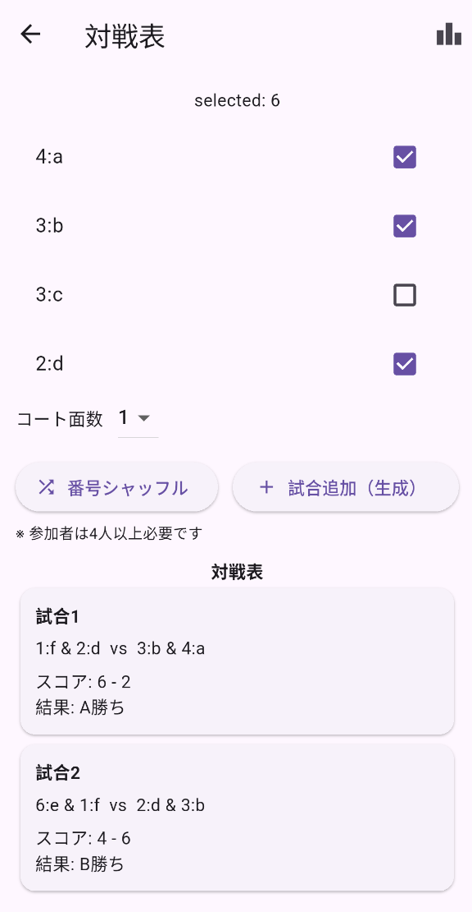

# Tennis Match Manager App

## 🎾 概要

大学テニスサークルの練習運営を効率化するために開発した
**ダブルス対戦表生成 & スコア管理アプリ**。

対戦作成の手間削減と、個人成績の可視化を実現する。

---

## 📱 Screenshots

### 対戦表画面

---

## 🚀 開発背景

実際の練習現場で以下の課題があった：

* 毎回ホワイトボードで対戦表を作るのに時間がかかる
* スコアが記録されず、成績が蓄積されない
* 練習会ごとにデータを分離できない

これらを解決するため、アプリとして設計・実装。

---

## 🧠 設計の特徴

### ① セッション単位の状態管理

* `Session`クラスに状態を集約
* 参加者・試合・スコアを一元管理
* UIとデータを分離

👉 UI = 表示、Session = 状態という責務分離

---

### ② オブジェクト指向設計

* `MatchPick` / `Session` / `PlayerStats` を定義
* データとロジックをクラス単位で管理
* getterで安全なデータ参照

---

### ③ 拡張性を意識した構造

* 永続化（SQLite）を前提とした設計
* セッション履歴の保存に対応可能
* Firebase連携を想定

---

## 🛠 技術構成

* Flutter
* Dart
* StatefulWidget（状態管理）
* Git / GitHub
* ドキュメント管理（docs）

---

## 📄 設計ドキュメント

* architecture.md
* session_design.md
* match_logic.md
* state_management.md

---

## 🔮 今後の実装予定

* SQLiteによるデータ永続化
* 勝率・ランキング自動算出
* ペア相性分析
* Firebaseによるクラウド同期
* コードのモジュール化（リファクタリング）

---

## 📚 学んだこと

* 状態管理設計の重要性
* UIとデータの責務分離
* 設計変更のコストと価値
* Gitによるチーム開発の基礎

---

## 💡 このプロジェクトについて

本プロジェクトは現在も改善を継続中。
実際のテニス練習現場での運用を想定しながら開発している。
